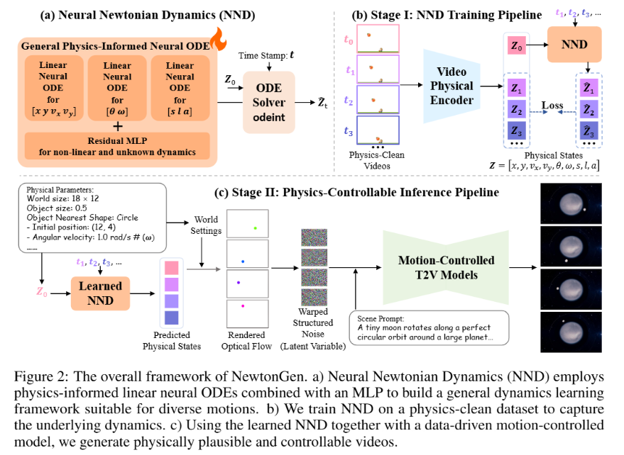

# NEWTONGEN: PHYSICS-CONSISTENT AND CONTROLLABLE TEXT-TO-VIDEO GENERATION VIA NEURAL  NEWTONIAN DYNAMICS

## INTRODUCTION

> In this paper, we introduce NewtonGen, a novel framework that integrates a data-driven, pre-trained video generator with physics-informed, Neural Newtonian Dynamics (NND). In NND, we introduce a neural ordinary differential equation (neural ODE) model to learn and predict the Newtonian motion from physics-clean data. By learning the dynamics of motion and manipulating its initial physical states, we can predict physics-consistent trajectories, orientations, and shapes. Subsequently,a motion-controlled video generator produces diverse and realistic videos by conditioning on both the predicted states and scene prompts

- **contribution** 

在本⽂中，我们介绍了 NewtonGen，这是⼀个将数据驱动、预训练的视频⽣成器与物理信息、神经⽜顿动⼒学（NND）相结合的新型框架。在 NND 中，我们引⼊了⼀个神经常微分⽅程（神经 ODE）模型，⽤于从物理⼲净的 数据中学习和预测⽜顿运动。通过学习运动动⼒学并操纵其初始物理状态，我们可以预测物理⼀致的轨迹、⽅向和形状。随后，⼀个受运动控制的视频⽣成器通过结合预测状态和场景提⽰来⽣成多样化和逼真的视频。

> We propose NewtonGen, a physics-consistent and controllable text-to-video framework that explicitly incorporates dynamics into the generation process, allowing for interpretable,white-box control over generated motion.

我们提出了 NewtonGen，这是⼀个物理⼀致且可控的⽂本到视频框架，它明确地将动⼒学纳⼊⽣成过程，允许对⽣成的运动进⾏可解释的、⽩盒控制。

> We introduce Neural Newtonian Dynamics (NND), which models different dynamics via unified neural ordinary differential equations (ODEs). NND can efficiently learn the latent dynamics from a small amount of physics-clean data

我们引⼊了神经⽜顿动⼒学（NND），它通过统⼀的神经常微分⽅程（ODEs）对不同的动⼒学进⾏建模。NND 能够从少量物理⼲净的数据中⾼效地学习潜在动⼒学。

## RELATED WORK

### VIDEO GENERATION MODELS

### PHYSICS -AWARE GENERATION

### LEARN PHYSICS FROM VIDEOS

## PRELIMINARY CONCEPTS

### INCORPORATING PHYSICAL DYNAMICS INTO DATA -DRIVEN VIDEO GENERATION

### MODELING THE DYNAMICS IN A GENERAL PHYSICS-INFORMED NEURALODE

> Physics textbooks tell us that if we are given the initial position, initial velocity, accelerationand mass, we can predict the trajectory of how the object moves in space and time. In mathematics,this is done through ordinary differential equations (ODEs). Based on this intuition, we consider asecond-order system governed by autonomous ODEs with no explicit time-varying external forces.We constrain the ODEs to the second order, because most common physical motions in daily life (e.g.,flying balls) can generally be described by second-order dynamics. Even in more complex motionsand three-dimensional scenes, the dynamics can still be effectively characterized by second-orderformulations over relatively short time intervals with sufficiently dense anchor points.

物理学教科书告诉我们，如果我们知道初始位置、初始速度、加速度和质量，我们就可以预测物体在空间和时间中的运动轨迹。在数学上，这是通过常微分⽅程（ODEs）实现的。基于这种直觉，我们考虑⼀个由⾃主 ODEs控制的⼆阶系统，其中没有显式的时间变化外部⼒。我们将 ODEs 限制为⼆阶，因为⽇常⽣活中最常⻅的物理运动（例如⻜⾏的球）通常可以⽤⼆阶动⼒学来描述。即使在更复杂的运动和三维场景中，动⼒学仍然可以通过在具有⾜够密集锚点的相对短时间间隔内使⽤⼆阶公式来有效地表征。

> To handle a wide range of video generation tasks, we require the ODE framework capable of accommodating diverse dynamics. This raises the following question: how can we construct a universal ODE framework that can describe various types of motion? To this end, we introduce two key design principles:

>1. **Latent Physical States**. We define a 9-dimensional latent physical state vector $Z = [x,y,v_x,v_y,\theta,\omega,s,l,a]$. Here, $x,y$ represent the position, and $v_x,v_y$ represent velocity of the object’s center of mass. $\theta,\omega$ encode the object’s rotation or rotation about a pivot point. $s,l$ are the object’s shortest and longest dimensions, and $a$ is its projected area. This formulation allows our physical states to capture translation, rotation, deformation, and other complex behaviors. 3D motion can also be equivalently realized through the combination of position and size control.

>2. **Linear Physics-Informed Neural ODEs with a Residual MLP**. Different motions follow inherently different dynamical laws: for instance, free-fall can be described by a simple linear ODE, while a damped pendulum or other unknown motion cannot. To address this, we combine linear physics-informed neural ODEs with a residual multilayer perceptron (MLP) as illustrated in Equation 4 and Figure. 2(a). The linear ODEs capture the dominant linear dynamics, while the residual MLP models nonlinear and unknown components, enabling the system to flexibly approximate a wide range of physical behaviors.
$$a_z \ddot{z} + b_z \dot{z} + c_z z + d_z + \text{MLP}(Z) = 0 \tag{4}$$
where $z$ is one element of the 9-dimensional latent physical state vector $Z$, and $a_z,b_z,c_z,d_z$ are learnable parameters of the linear ODE. We can use multiple ODEs to predict future physical states in a compact autonomous form:
$$Z_t = Z_0 + \int_{t_0}^{t} \text{Func}(Z(\tau)) d\tau, \tag{5}$$
where $\text{Func}(Z(\tau))$ represents the collection of all individual $dz/dt$ ODEs, and $Z_0 = Z(t_0)$ is the known initial physical state at time $t_0$.

为了应对各类视频生成任务，我们需要能适配多样动力学的常微分方程（ODE）框架。这引出了一个问题：如何构建一个能描述各类运动的通用ODE框架？为此，我们提出两个核心设计原则：

1. **潜物理状态**。我们定义了一个9维潜物理状态向量$Z = [x,y,v_x,v_y,\theta,\omega,s,l,a]$。其中，$x,y$代表物体质心的位置，$v_x,v_y$代表质心的速度；$\theta,\omega$编码物体的自转或绕支点的转动；$s,l$是物体的最短与最长维度，$a$是其投影面积。这种设计使我们的物理状态能够捕捉平动、转动、形变及其他复杂行为，3D运动也可通过位置与尺寸控制的结合等效实现。

2. **带残差MLP的线性物理感知神经ODE**。不同运动遵循的动力学定律本质上存在差异：例如，自由落体可由简单的线性ODE描述，但阻尼摆或其他未知运动则无法如此。为解决这一问题，我们将线性物理感知神经ODE与残差多层感知器（MLP）相结合（如公式4与图2(a)所示）。线性ODE捕捉主导的线性动力学，而残差MLP则建模非线性与未知组件，使系统能灵活逼近各类物理行为。
$$a_z \ddot{z} + b_z \dot{z} + c_z z + d_z + \text{MLP}(Z) = 0 \tag{4}$$
其中$z$是9维潜物理状态向量$Z$的一个元素，$a_z,b_z,c_z,d_z$是线性ODE的可学习参数。我们可通过多个ODE以紧凑的自治形式预测未来物理状态：
$$Z_t = Z_0 + \int_{t_0}^{t} \text{Func}(Z(\tau)) d\tau, \tag{5}$$
这里$\text{Func}(Z(\tau))$代表所有独立$dz/dt$ ODE的集合，$Z_0 = Z(t_0)$是时刻$t_0$已知的初始物理状态。

## METHODOLOGY

> **Overall Framework.** As shown in Figure. 2, NewtonGen consists of two main stages. As illustrated in Figure. 2(b), in the first stage, we train the proposed Neural Newtonian Dynamics (NND) on a small set of physics-clean data to learn the underlying motion dynamics and parameters. In the second stage shown in Figure. 2(c), we use the learned dynamics to predict future physical states from arbitrary initial conditions, and feed these predictions, together with the scene prompt, into amotion-controlled text-to-video generation model to produce the final video.

总体框架。如图 2 所⽰，NewtonGen 由两个主要阶段组成。如图 2(b)所⽰，在第⼀阶段，我们在少量物理⼲净的训练数据上训练所提出的神经⽜顿动⼒学（NND），以学习潜在的动⼒学和参数。在第⼆阶段，如图 2(c)所⽰，我们使⽤学习到的动⼒学从任意初始条件预测未来的物理状态，并将这些预测与场景提⽰⼀起输⼊到运动控制的⽂本到视频⽣成模型中，以⽣成最终视频。

### NEURAL NEWTONIAN DYNAMICS

### TRAINING FOR NEURAL NEWTONIAN DYNAMICS

>Overall Training Pipeline. Figure. 2(b) illustrates that, for training Neural Newtonian Dynamics (NND), we adopt an encoder-only architecture. This design does not require decoding back to images, and optimizes solely in the latent physical space, significantly reducing computational cost. Specifically, a Video Physical Encoder $E_{\text{phys}}$ compresses each video frame into its corresponding physical state. The initial state $\hat{Z}_0$ and the sequence of frame time stamps $(t_1,t_2,t_3,\dots)$ are fed into NND, which predicts $(\hat{Z}_1,\hat{Z}_2,\hat{Z}_3,\dots)$. The loss is then computed between the predicted states and the states $(Z_1,Z_2,Z_3,\dots)$ extracted by the Encoder $E_{\text{phys}}$:
$$\text{Loss} = \frac{1}{T} \sum_{t=1}^{T} \left\| \underbrace{E_{\text{phys}}(I_t)}_{Z_t} - \underbrace{\text{NND}_{\kappa}(E_{\text{phys}}(I_0), t)}_{\hat{Z}_t} \right\|_2^2 \tag{6}$$
where $T$ denotes the number of sampled time stamps, $I_t$ is the video frame at time $t$, and $\kappa$ represents the learnable parameters of the ODEs.

整体训练流程。图2(b)显示，在训练神经牛顿动力学（NND）时，我们采用仅编码器架构。该设计无需解码回图像，仅在潜物理空间中进行优化，显著降低了计算成本。具体而言，视频物理编码器$E_{\text{phys}}$会将每个视频帧压缩为其对应的物理状态；初始状态$\hat{Z}_0$与帧时间戳序列$(t_1,t_2,t_3,\dots)$被输入NND，由其预测$(\hat{Z}_1,\hat{Z}_2,\hat{Z}_3,\dots)$。损失则在预测状态与编码器$E_{\text{phys}}$提取的状态$(Z_1,Z_2,Z_3,\dots)$之间计算：
$$\text{Loss} = \frac{1}{T} \sum_{t=1}^{T} \left\| \underbrace{E_{\text{phys}}(I_t)}_{Z_t} - \underbrace{\text{NND}_{\kappa}(E_{\text{phys}}(I_0), t)}_{\hat{Z}_t} \right\|_2^2 \tag{6}$$
其中$T$表示采样时间戳的数量，$I_t$是时刻$t$的视频帧，$\kappa$代表ODE的可学习参数。

> **Training Data. **To enable Neural Newtonian Dynamics to learn accurate and effective representations of physical dynamics, we require “physics-clean” video data. That is, the motion in the videos should be prominent and monotonic, with no motion blur or excessive noise in each frame, and minimal color, texture, or background distractions. However, to our knowledge, such high-quality datasets of physical dynamics are still lacking. To address this, we developed a Python-based physics data simulator that can render videos with precise timestamps for different world settings, initial conditions,and types of dynamics. Simulation code and some sample videos are shown in the Supplementary Material.

**训练数据。**为了使神经⽜顿动⼒学能够学习物理动⼒学的准确和有效表⽰，我们需要“物理纯净”的视频数据。也就是说，视频中的运动应该突出且单调，每⼀帧都没有运动模糊或过度噪声，并且颜⾊、纹理或背景⼲扰最⼩。然⽽，据我们所知，⽬前仍然缺乏此类⾼质量的物理动⼒学数据集。为了解决这个问题，我们开发了⼀个**基于 Python 的物理数据模拟器**，该模拟器可以渲染具有精确时间戳的视频，这些时间戳对应于不同的世界设置、初始条件和动⼒学类型。模拟代码和⼀些⽰例视频显⽰在补充材料中。

>**Video Physical Encoder.** To extract physical state labels from videos, we first apply the visual segmentation foundation model SAM2 (Ravi et al., 2025) to obtain masks for the dynamic regions in each frame. From the extracted masks, we compute object attributes such as position, velocity, geometry, and area using morphological analysis and OpenCV-based tools. Finally, these attributes are uniformly quantized to form the physical states Z.

**视频物理编码器。**为了从视频中提取物理状态标签，我们⾸先应⽤视觉分割基础模型 SAM2（Ravi 等⼈，2025）来获取每帧中动态区域的掩码。从提取的掩码中，我们使⽤形态学分析和基于 OpenCV 的⼯具计算对象属性，如位置、速度、⼏何形状和⾯积。最后，这些属性被统⼀量化形成物理状态 Z。

### INFERENCE FOR PHYSICAL-CONTROLLABLE TEXT -TO-VIDEO GENERATION

##  个人记录

### 物理现象

本文实验针对**12类牛顿物理运动/形变现象**展开，统一采用9维潜物理状态$Z=[x,y,v_x,v_y,\theta,\omega,s,l,a]$表征（$x/y$为质心位置、$v_x/v_y$为质心速度、$\theta$为旋转角度、$\omega$为角速度、$s/l$为最短/最长维度、$a$为投影面积），通用参数范围为**速度0–15 m/s**、**运动时长1–2秒**，以下为各类现象专属参数：

| 物理现象 | 核心评估物理量（PIS指标） | 初始/控制参数 | 潜物理状态约束 |
|----------|--------------------------|---------------|----------------|
| 匀速运动 | $v_x$（水平速度） | 物体沿光滑表面水平匀速移动，无外力干扰 | $v_x$恒定、$v_y≈0$、$\omega=0$、$s/l/a$无变化 |
| 匀加速运动 | $a_x$（水平加速度） | 物体沿平直路面从低速/静止开始水平匀加速 | $a_x$为固定正值、$v_x$线性增长、$\omega=0$、$s/l/a$无变化 |
| 匀减速运动 | $-a_x$（水平减速加速度） | 物体沿道路从高速开始水平匀减速 | $a_x$为固定负值、$v_x$线性降低、$\omega=0$、$s/l/a$无变化 |
| 抛物运动 | $v_x$（水平速度）、$a_y$（竖直加速度） | 物体以固定角度斜抛，如初始位置$[x=2.0,y=10.0]$、初始速度$[v_x=5.0m/s,v_y=-0.8m/s]$ | $v_x$恒定、$a_y$近似重力加速度、$\omega=0$、$s/l/a$无变化 |
| 3D运动 | $v_y$（竖直速度）、$\Delta l$（长轴增量率） | 物体从远处向镜头移动，模拟近大远小 | $v_y$恒定、$\Delta l$均匀增大、$l/s$比例不变、$\omega=0$ |
| 斜面滑动 | $a_x$（水平加速度）、$a_y$（竖直加速度） | 物体沿光滑斜面由静止下滑 | $a_x/a_y$为固定分量、$\omega=0$、$s/l/a$无变化 |
| 圆周运动 | $\omega$（轨道角速度） | 天体绕中心公转，如初始位置$[x=12,y=4]$、初始角速度$\omega=1.0rad/s$、世界尺寸$18×12$ | $\omega$恒定、$x/y$呈圆周轨迹、$s/l/a$无变化 |
| 定轴转动 | $\omega$（自转角速度） | 物体绕自身轴线转动，无水平位移 | $\omega$恒定、$\theta$线性增加、$v_x=v_y=0$、$s/l/a$无变化 |
| 带自转的抛物运动 | $v_x$、$a_y$、$\omega$（自转角速度） | 物体斜抛且伴随自转，如画笔/钢笔抛射 | 同时满足抛物轨迹（$v_x/a_y$恒定）和匀速自转（$\omega$恒定） |
| 阻尼振动 | $a_y$（竖直加速度） | 悬挂铃铛/单摆小幅摆动，悬挂点固定 | $a_y$近似恒定、$y$位置周期性衰减、$\omega$随摆角周期变化、$x$固定 |
| 尺寸变化 | $\Delta r$（半径增量率） | 气球均匀充气，初始尺寸$s=0.3/0.6$ | $\Delta r$恒定、$s/l/a$均匀增大、$l/s$比例不变、$v_x=v_y=\omega=0$ |
| 形变 | $\Delta l$（长轴增量率） | 面团/酸奶均匀摊平，初始为长条状 | $\Delta l$恒定、$l$增大且$s$可减小、$a$随面积变化、$v_x=v_y=\omega=0$ |

注：所有现象均采用**5帧移动平均滤波**预处理视频，以$0.00625米/像素$完成像素-物理单位映射，PIS值越接近1表示物理一致性越强。

### Prompt

1. Uniform Motion（匀速运动）
- Prompt 1：A small metal cube sliding steadily along a smooth laboratory bench, reflections visible on the surface, scattered tools in the background, captured from a fixed side camera.  
- Prompt 2：A red rubber ball rolling at constant speed on a polished wooden floor, pulled by a thin string, with scattered papers and books in the background, observed from a fixed side camera.  

2. Acceleration（匀加速运动）
- Prompt 1：A red sedan accelerating in a straight line on a clean highway, the road flat and clear, with only a pale sky and distant horizon in the background, captured from a fixed roadside camera.  
- Prompt 2：A black off-road SUV accelerating in a straight line on sandy terrain, with continuous sand dunes in the background, a few white clouds in the sky, sunlight slanting, kicking up fine sand particles, viewed from a stationary side-angle camera.  

3. Deceleration（匀减速运动）
- Prompt 1：A yellow bus decelerates in a straight line in front of a traffic light on a city street, with pedestrians crossing nearby, and the wet road reflecting the sky, captured by a fixed side-view camera.  
- Prompt 2：A red coach brakes and decelerates in a straight line on a highway, with road signs and streetlights nearby and the city skyline visible in the distance, captured by a fixed side-view camera.  

4. Parabolic Motion（抛物运动）
- Prompt 1：A golf ball is hit at an angle with an initial speed. The camera captures its parabolic trajectory from the side. The scene takes place on a sunny golf course with manicured fairways, sand bunkers, and distant trees, adding depth and realism.  
- Prompt 2：A volleyball is served at an angle, captured from the side by a stationary camera. The scene is set on an outdoor beach volleyball court, with sand texture, net, and distant palm trees in view.  

5. 3D Motion（3D运动）
- Prompt 1：A fighter jet accelerates slowly from the distance along the runway towards the camera, hangars and runway lights visible in the background, captured from a fixed oblique side camera.  
- Prompt 2：A cardboard box slides from the distance along a warehouse floor towards the camera, shelves and crates visible in the background, captured from a fixed oblique side camera.  

6. Slope Sliding（斜面滑动）
- Prompt 1：A hardcover book accelerating down a carpeted inclined board in a classroom, chalkboard and desks in the background, captured from a fixed side camera parallel to the ramp.  
- Prompt 2：A small metal cube sliding down a laboratory ramp, shiny reflections on its surface, scattered tools and wires in the background, captured from a fixed side camera parallel to the ramp.  

7. Circular Motion（圆周运动）
- Prompt 1：A tiny moonlet orbits a gas giant along a smooth, circular path. The top-down view shows the consistent motion without motion trails.  
- Prompt 2：A comet with a glowing tail orbits a distant star along a stable circular path. A top-down perspective emphasizes the symmetrical orbit and the stationary central star.  

8. Rotation（定轴转动）
- Prompt 1：A metal rod spinning on a concrete floor, faint scratches and dust visible, captured from a fixed top-down camera.  
- Prompt 2：A wooden dowel rotating gently on a tiled kitchen floor, soft shadows from ceiling lights, viewed from a stationary overhead camera.  

9. Parabolic Motion with Rotation（带自转的抛物运动）
- Prompt 1：A pen is thrown at an angle, rotating as it falls. Captured from a side camera, the notebook and desk provide background details and depth.  
- Prompt 2：A thin cylindrical rod gently tossed, rotating along its long axis, fixed side camera, realistic reflections, ground shadows visible, subtle motion blur.  

10. Damped Oscillation（阻尼振动）
- Prompt 1：A small decorative bell hanging from a fine chain. The fixed camera captures realistic material and shadows.  
- Prompt 2：A realistic pendulum with a spherical bob swinging from a fixed pivot. The fixed camera captures the entire motion.  

11. Size Changing（尺寸变化）
- Prompt 1：A red helium balloon gradually inflating in a sunny park, children playing in the background, trees casting soft shadows, captured from a stationary side camera.  
- Prompt 2：A transparent water balloon expanding in a laboratory, scientific instruments and glassware around, bright fluorescent lights overhead, captured from a fixed top-down camera.  

12. Deformation（形变）
- Prompt 1：A long strip of yogurt slowly spreads into a smooth layer, captured by a fixed overhead camera.  
- Prompt 2：A long strip of jelly gradually deforms and flattens on a plate, captured by a fixed overhead camera.