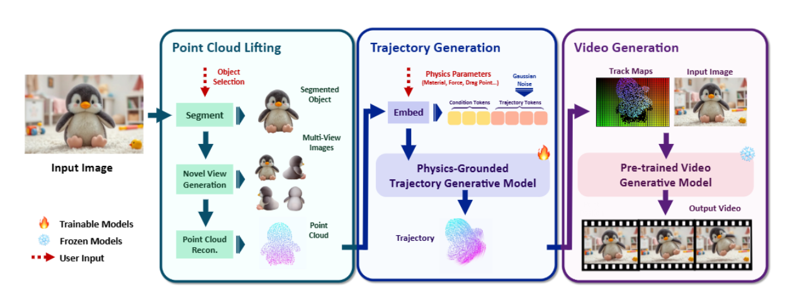
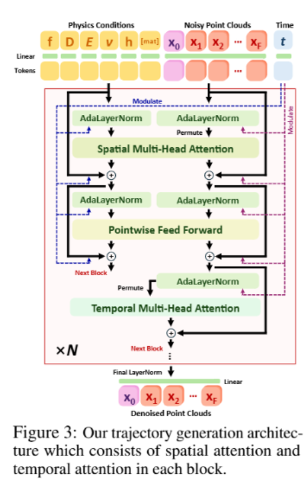

# PhysCtrl: Generative Physics for Controllable andPhysics-Grounded Video Generation

## Introduction

>While physics simulators based on Newtonian mechanics can model the dynamics of diverse real-world systems—including soft/rigid bodies, fluids,and gases [37,59 ,56], they suffer from high computational cost, sensitivity to hyperparameters(e.g., simulation substeps, grid size), numerical instabilities, and trade-offs between generality and accuracy. As a result, when directly using a physics simulator for video generation, people have to tune several hyperparameters and might need to switch simulators with regard to object material (e.g, MPM for elastic and rigid body simulators for rigid). It might also lack robustness and suffer from slow speed (especially for inverse problems).

虽然基于⽜顿⼒学的物理模拟器可以模拟多种现实世界系统的动⼒学——包括软/刚体、流体和⽓体[37, 59, 56]，但它们存在计算成本⾼、对超参数（例如模拟⼦步⻓、⽹格⼤⼩）敏感、数值不稳定性以及通⽤性与准确性之间的权衡等问题。因此，当直接使⽤物理模拟器进⾏视频⽣成时，⼈们必须调整多个超参数，并且可能需要根据物体材质（例如，MPM ⽤于弹性体模拟，刚体模拟器⽤于刚体）切换模拟器。这也可能导致缺乏鲁棒性，并且速度较慢（尤其是对于逆问题）

### PhysCtrl

> To address these issues, we propose PhysCtrl, a framework for physics-grounded image-to-video generation with explicit control over physical parameters and external forces. A key component of our framework is a generative physics network, a diffusion-based model that learns the distribution of physical dynamics. It works on various material types, requires minimal user input and supports fast forward and backward. Conditioned on physical parameters and applied forces, it predicts physical dynamics that serve as control signals for pretrained video generative models [24].

为解决这些问题，我们提出了 PhysCtrl，⼀个具有物理参数和外部⼒显式控制的物理基础图像到视频⽣成框架。我们框架的关键组件是⼀个⽣成物理⽹络，这是⼀个基于扩散的模型，学习物理动⼒学的分布。它适⽤于各种材料类型，需要极少的⽤⼾输⼊，并⽀持快速正向和反向。在物理参数和应⽤⼒的条件下，它预测物理动⼒学，这些动⼒学作为预训练视频⽣成模型的控制信号[24]。

###  Two fundamental questions

1. 为视频模型提供控制，物理动⼒学的适当表⽰

>Very recent work on controllable video generation [21,24] has shown that video models can synthesize rich and coherent content from only sparse and explicit point controls. Meanwhile, point clouds offer greater flexibility and generalization for modeling different materials than other explicit representations, such as meshes or voxel grids, making them more suitable for learning-based generative physics networks. Considering these two aspects, we propose to represent physical dynamics as 3D point trajectories, enabling compact motion encoding and seamless integration with video generative models while supporting diverse material types.

最近关于可控视频⽣成的研究[21, 24]表明，视频模型可以从稀疏和显式的点控制中合成丰富且连贯的内容。同时，与⽹格或体素⽹格等其他显式表⽰相⽐，点云为建模不同材料提供了更⼤的灵活性和泛化能⼒，使其更适合⽤于基于学习的⽣成物理⽹络。考虑到这两个⽅⾯，我们提出将物理动⼒学表⽰为 3D 点轨迹，这能够实现紧凑的运动编码，并与视频⽣成模型⽆缝集成，同时⽀持多种材料类型。

2. 将各种材料中的⽣成式物理先验嵌⼊到⽹络中

> High-quality and diverse data are essential for learning the distribution of physical dynamics (i.e.,generative physics).We therefore collect a large-scale synthetic dataset of 550K object animations across four material types (elastic, sand, plasticine, and rigid), capturing complex, physics-grounded dynamics via physics simulators. Using this dataset, we design a diffusion model to generate physics-plausible 3D motion trajectories conditioned on physical conditions. Inspired by particle dynamics [37], where particles interact with neighbors to determine their next state, we introduce a novel spatiotemporal attention block in the diffusion model to emulate these interactions: it first aggregates spatial influences from neighboring points and then predicts each point’s trajectory over time. Finally, to embed explicit physical knowledge directly into the network, we incorporate physics-based constraints during training, ensuring that the generated motions are physics-plausible.

⾼质量和多样化的数据对于学习物理动态的分布（即⽣成式物理）⾄关重要。因此，我们收集了⼀个包含 550K 个物体动画的⼤规模合成数据集，涵盖四种材料类型（弹性、沙⼦、油泥和刚性），通过物理模拟器捕捉复杂且基于物理的动态。利⽤这个数据集，我们设计了⼀个扩散模型，根据物理条件⽣成具有物理合理性的 3D 运动轨迹。受粒⼦动⼒学[37]的启发，其中粒⼦通过与邻居相互作⽤来确定其下⼀个状态，我们在扩散模型中引⼊了⼀个新的时空注意⼒模块来模拟这些相互作⽤：它⾸先从邻近点聚合空间影响，然后预测每个点随时间的轨迹。最后，为了将显式的物理知识直接嵌⼊到⽹络中，我们在训练过程中引⼊了基于物理的约束，确保⽣成的运动是符合物理规律的.

## Related Work

### Neural Physical Dynamics

>Traditionally, physical dynamics are solved with numerical methods such as finite element method (FEM) [102], position-based dynamics (PBD) [60,55], material point method (MPM) [37], smoothed-particle hydrodynamics (SPH) [17,63 ,43] and mass-spring systems [52]. Physical Informed Neural Networks (PINNs) [64] use neural networks to approximatethe solution of partial differential equations and incorporate physics constraints in the loss functions.

传统上，物理动⼒学通过有限元⽅法（FEM）[102]、基于位置的动⼒学（PBD）[60,55]、材料点法（MPM）[37]、平滑粒⼦流体动⼒学（SPH）[17, 63, 43] 和质点弹簧系统 [52] 等数值⽅法求解。物理信息神经⽹络（PINNs）[64] 利⽤神经⽹络逼近偏微分⽅程的解，并在损失函数中融⼊物理约束。

> Concurrent work, ElastoGen [19], replaces part of thephysics simulation with neural networks for faster inference, but relies on a voxel representation,supports only elastic materials, and requires a full 3D model as input

同时进⾏的 ElastoGen [19] 研究，⽤神经⽹络替代部分物理模拟以实现更快推理，但依赖于体素表⽰，仅⽀持弹性材料，并需要完整的三维模型作为输⼊。

> In contrast, our method represents objects as flexible point clouds and leverages a spatiotemporal trajectory diffusion model to robustly capture the dynamics of diverse materials in a unified framework.

相⽐之下，我们的⽅法将对象表⽰为灵活的点云，并利⽤时空轨迹扩散模型在⼀个统⼀的框架中稳健地捕捉不同材料的动态

### Controllable Video Generative Models

>Video generative models are trained on massive text-videopaired datasets and achieve high-quality video generation [29, 4,41 ,11 ,94]. Existing works haveshown that additional control signals can be injected into pretrained models for controllable videogeneration, such as camera movement [25,20], human pose [30], and point movement [21 ,24 , 5].

可控视频⽣成模型在⼤量的⽂本-视频配对数据集上进⾏训练，实现⾼质量的视频⽣成[29, 4 , 41, 11 , 94]。现有⼯作表明，可以通过预训练模型注⼊额外的控制信号来实现可控视频⽣成，例如摄像机运动[25 , 20 ]、⼈体姿态[30 ]和点运动[21 , 24 , 5]。

> However, these models lack an understanding of physical laws and thus generate outputs that are often not physically plausible. Furthermore, they cannot support explicit physics control. Our work focuses on generating physics-grounded dynamics that can be used as a physics control signal for video models.

然⽽，这些模型缺乏对物理定律的理解，因此⽣成的输出往往不具备物理合理性。此外，它们⽆法⽀持显式的物理控制。我们的⼯作专注于⽣成基于物理的动态，这些动态可以⽤作视频模型的物理控制信号。

### Physics-Grounded Video Generation

> Existing methods leverage physics simulators to producephysics-grounded videos. One approach reconstructs neural representations from multi-view images,applies simulation on these representations, and then renders the results into video

现有⽅法利⽤物理模拟器来⽣成基于物理的视频。⼀种⽅法是从多视⻆图像中重建神经表⽰，对这些表⽰进⾏模拟，然后将结果渲染成视频。

> Compared with methods that rely on physics simulators, our method embeds physics priors into a diffusion model, which avoids manual hyperparameter tuning and improves numerical stability for dynamics prediction. The predicted dynamics can be used as guidance for video generative models to synthesize physics-grounded and controllable videos. Concurrent works WonderPlay [48] and Force Prompting [22] also investigate using force as the condition signal for video generation.

与依赖物理模拟器的⽅法相⽐，我们的⽅法将物理先验嵌⼊到扩散模型中，避免了⼿动超参数调整，并提⾼了动⼒学预测的数值稳定性。预测的动⼒学可⽤于作为视频⽣成模型的指导，以合成物理基础可控的视频。同时⼯作的 WonderPlay [ 48 ] 和 Force Prompting [22 ] 也研究了使⽤⼒作为视频⽣成的条件信号。

### 4D Dynamics

> Recent advances in 4D dynamics have been exploring to capture object dynamics of arbitrary topologies [61, 57, 77, 45, 77,12] with Neural-ODE and coordinate-MLPs.

4D 动⼒学的最新进展正在探索使⽤ Neural-ODE 和坐标-MLPs 捕获任意拓扑结构的物体动⼒学 [61, 57, 77, 45, 77, 12]。

> However, these methods are only trained on datasets with a limited number of shapes that contain only human and animal motions, while our method focuses on learning physics-grounded dynamics, which contain a large variety of dynamic phenomena. We also use a more flexible point representation that is better suited for downstream tasks.

然⽽，这些⽅法仅在包含仅有⼈类和动物运动的有限形状数据集上进⾏训练，⽽我们的⽅法专注于学习物理基础的动态，其中包含各种动态现象。我们还使⽤了⼀种更灵活的点表⽰，更适合下游任务。

## Preliminary

我们通过物理模拟器（包括MPM与刚体模拟器）生成的合成数据，来构建生成式物理网络（也称为“物理约束轨迹生成模型”）的训练用真实点轨迹。下文将回顾MPM的基础原理，这是我们在第4节中引入物理感知约束的核心依据。

物质点法（Material Point Method, MPM）[75, 65, 40, 37, 35, 31, 91]在连续介质力学的假设下，模拟离散物质粒子的形变：每个粒子从材料空间到世界空间的变换由形变映射$\boldsymbol{x} = \phi(\mathbf{X}, t)$定义，对应的**形变梯度**$\mathbf{F} = \nabla_{\mathbf{X}} \phi(\mathbf{X}, t)$用于度量材料的局部形变（如旋转、拉伸）。

$\phi$在时刻$t$的演化遵循**质量守恒与动量守恒定律**，其数学表达式为：
$$
\begin{cases}
\rho \frac{D\boldsymbol{v}}{Dt} = \nabla \cdot \boldsymbol{\sigma} + \boldsymbol{f}_{\text{ext}} \\
\frac{D\rho}{Dt} + \rho \nabla \cdot \boldsymbol{v} = 0
\end{cases} \tag{1}
$$
其中，$\rho$、$\boldsymbol{v}$、$\boldsymbol{f}_{\text{ext}}$分别表示密度、速度场、单位体积的外力。

**柯西应力**$\boldsymbol{\sigma}$与能量密度函数$\Psi(\mathbf{F})$的关系为：
$$\boldsymbol{\sigma} = \frac{1}{\det(\mathbf{F})} \frac{\partial \Psi}{\partial \mathbf{F}}(\mathbf{F}) \mathbf{F}^\top$$
能量密度函数$\Psi(\mathbf{F})$由形变梯度与物理参数（如杨氏模量$E$、泊松比$\nu$）共同决定，具体形式与材料的本构模型相关。

基于式(1)，MPM在模拟中通过**粒子-网格（P2G）**与**网格-粒子（G2P）**的循环传递，将粒子与背景网格关联：
1. 粒子-网格（P2G）传递（从$t$到$t+1$）
$$
\frac{m_i}{ \Delta t } \left( \boldsymbol{v}_i^{t+1} - \boldsymbol{v}_i^t \right) = -\sum_p V_p^0 \frac{\partial \Psi}{\partial \mathbf{F}} \left( \mathbf{F}_p^t \right) \mathbf{F}_p^t{}^\top \nabla N_i \left( \boldsymbol{x}_p^t \right) \tag{2}
$$
其中：
- $p$、$i$分别表示粒子与网格的属性；
- $V_p^0$为粒子的初始体积；
- $N_i(\boldsymbol{x}_p^t)$是在$\boldsymbol{x}_p^t$处计算的第$i$个网格的B样条核函数；
- 网格质量$m_i^t = \sum_p N_i(\boldsymbol{x}_p^t) m_p$、网格动量$m_i^t \boldsymbol{v}_i^t = \sum_p N_i(\boldsymbol{x}_p^t) m_p \left( \boldsymbol{v}_p^t + \mathbf{C}_p^t (\boldsymbol{x}_i - \boldsymbol{x}_p^t) \right)$由标准APIC方法[36]计算（$\mathbf{C}_p^t$为仿射矩阵）。

2. 网格-粒子（G2P）传递
$$
\begin{cases}
\mathbf{C}_p^{t+1} = \frac{4}{(\Delta x)^2} \sum_i N_i \left( \boldsymbol{x}_p^t \right) \boldsymbol{v}_i^{t+1} \left( \boldsymbol{x}_i - \boldsymbol{x}_p^t \right)^\top \\
\mathbf{F}_p^{t+1} = \left( \mathbf{I} + \Delta t \sum_i \boldsymbol{v}_i^{t+1} \nabla N_i \left( \boldsymbol{x}_p^t \right)^\top \right) \mathbf{F}_p^t
\end{cases} \tag{3}
$$

3. 参数更新
完成传递后，粒子的速度与位置更新为：
$$
\boldsymbol{v}_p^{t+1} = \sum_i N_i \left( \boldsymbol{x}_p^t \right) \boldsymbol{v}_i^{t+1}, \quad \boldsymbol{x}_p^{t+1} = \boldsymbol{x}_p^t + \Delta t \boldsymbol{v}_p^{t+1}
$$

## Method

> Given a monocular image, our method generates physics-grounded videos with the control signals of physics parameters and external forces. The core part of our method is a conditional diffusion model to generate physics-grounded point cloud trajectories (Section 4.1) with physics parameters and external forces as conditioning. To enable that, as illustrated in Figure 2, we first lift the input image into 3D points (Section 4.2). Once we obtain the generated trajectories, we leverage them as the condition to pre-trained video models for image-to-video synthesis (Section 4.2).

给定单目图像，我们的方法会生成基于物理原理的视频，并附带物理参数和外力的控制信号。我们方法的核心部分是一个条件扩散模型，该模型以物理参数和外力作为条件，生成基于物理原理的点云轨迹（第4.1节）。为实现这一点，如图2所示，我们首先将输入图像转换为三维点（第4.2节）。一旦获得生成的轨迹，我们就将其作为条件，利用预训练的视频模型进行图像到视频的合成（第4.2节）。

### Physics-Grounded Generative Dynamics

> Figure 2:An overview of PhysCtrl. Given a single image, we first lift the object in that image into3D points. We then generate physics-grounded motion trajectories conditioned on physics parametersand external force with a diffusion model, which are then used as strong physics-grounded guidancefor image-to-video generation.

图2：PhysCtrl概述。给定单张图像，我们首先将该图像中的物体转换为三维点。然后，我们使用扩散模型生成以物理参数和外力为条件的基于物理的运动轨迹，这些轨迹随后被用作图像到视频生成的强大物理基础指导。

> We select point clouds as our representation because they flexibly model diverse materials and suffice to control pretrained video models. Specifically, each object is represented by 2048 points in practice; we predict their trajectories over time and use them as control signals for video synthesis. We use 2048 points for guiding video model because prior work [24] show that it can achieve similar results with more points. Also, works on 4D reconstruction and generation [34, 46, 97] demonstrated that real-world motion can be represented with a sparse number of basis or control points.

我们选择点云作为表示方式，因为它们能灵活地对各种材料进行建模，并且足以控制预训练的视频模型。具体来说，在实际应用中，每个物体由2048个点表示；我们预测这些点随时间的轨迹，并将其用作视频合成的控制信号。我们使用2048个点来指导视频模型，因为先前的研究[24]表明，使用这一数量的点能取得与使用更多点时相似的结果。此外，关于4D重建和生成的研究[34,46,97]已经证明，现实世界的运动可以用少量的基元点或控制点来表示。

#### Problem Setting

给定一个物体，其表示为包含$$N$$个点的3D点云$$\mathbf{P}_0 = \{\mathbf{x}_i^0 \in \mathbb{R}^3\}_{i=1}^N$$，同时给定其物理参数$$\{E, \nu\}$$，我们的轨迹生成模型会在初始力的作用下，生成该物体的动力学过程。

具体而言，物体的动力学过程由每个点在后续$$F$$个时间步中的位置来表示，记为：
$$\mathcal{P} = \mathcal{P}^{1:F} = \{\mathbf{P}^f\}_{f=1}^F = \{\{\mathbf{x}_p^f\}_{p=1}^N\}_{f=1}^F$$

我们将力、拖拽点与边界条件（地面高度）分别记为$$\mathbf{f} \in \mathbb{R}^3$$、$$\mathbf{D} \in \mathbb{R}^3$$和$$h \in \mathbb{R}^1$$。

因此，PhysCtrl的目标是在条件$$c = \{\mathbf{P}_0, \mathbf{f}, \mathbf{D}, \{E, \nu\}, h, [\text{mat}]\}$$下预测轨迹$$\mathcal{P}$$。此处，我们额外引入$$[\text{mat}]$$标记来表示不同的材料。

本文中，我们涵盖了四种材料：弹性材料、橡皮泥、沙子和刚性材料。值得注意的是，得益于我们灵活的点云表征方式，该模型并不局限于这四类材料；若有充足的计算资源，它可轻松扩展至流体等其他材料。

我们的轨迹生成模型是在物理模拟器（MPM [37]与刚体求解器）生成的数据上进行训练的。 模拟器的超参数（例如子步长、网格大小）会引入变异性，而我们的模型仅以核心物理参数为条件，无法直接捕捉这种变异性。为了应对这种不确定性，我们采用扩散模型来学习条件分布$$p(P|c)$$​。 由于我们的方法仅需要采样得到的点，因此它也可以扩展到从更多模拟方法中学习物理规律。

#### Physics-grounded Trajectory Generative model

> Instead, since we aim to model point cloud trajectories with a one-to-one point correspondence across frames, we introduce an efficient attention mechanism tailored for physics simulation data, which first applies spatial attention followed by temporal attention. This design reduces the computational complexity and, more importantly, reflects the underlying process of physics simulation: first integrating information from neighboring points, then propagating forward in time dimension.

相反，由于我们旨在对帧间⼀⼀对应的点云轨迹进⾏建模，我们引⼊了⼀种针对物理模拟数据的⾼效注意⼒机制，该机制⾸先应⽤空间注意⼒，然后应⽤时间注意⼒。这种设计降低了计算复杂度，更重要的是，它反映了物理模拟的底层过程：⾸先整合来⾃邻近点的信息，然后在时间维度上向前传播

> Specifically, given noisy point cloud sequences, we apply point embedding and project it to latent dimensions, add sinusoidal positional embeddings in both space and time and predict its trajectory offset with our denoising network $$\mathcal{D}$$. The core of network $$\mathcal{D}$$ is a diffusion transformer consisting of a set of spatial-temporal attention blocks as shown in Figure 3. Each block contains two attention layers: spatial attention and temporal attention.

具体而言，给定含噪点云序列，我们先进行点嵌入并将其投影到潜空间维度，再添加空间与时间维度的正弦位置编码，最后通过去噪网络$$\mathcal{D}$$预测其轨迹偏移量。网络$$\mathcal{D}$$的核心是一个扩散Transformer，由一组时空注意力块组成（如图3所示）。每个块包含两个注意力层：空间注意力层和时间注意力层。

> Spatial attention learns the correlation of each point with other points in the same frame with self-attention. To inject physical conditioning $$c$$ into the attention layer, we first map them into additional tokens using MLPs:
> $$\text{cond} = \text{MLP}_{\text{phys}}(\{\mathbf{f}; \mathbf{D}; \{E, \nu\}, h, [\text{mat}]\}) \in \mathbb{R}^{d_c}$$

空间注意力通过自注意力机制，学习同一帧内每个点与其他点之间的关联。为了将物理条件$$c$$注入注意力层，我们首先通过MLP将这些条件映射为额外的标记：
$$\text{cond} = \text{MLP}_{\text{phys}}(\{\mathbf{f}; \mathbf{D}; \{E, \nu\}, h, [\text{mat}]\}) \in \mathbb{R}^{d_c}$$

> Then, we concatenate them with point positions along the sequence dimension. Motivated by CogVideoX [94], we apply the adaptive layer norm to positional tokens and physical tokens separately to facilitate the alignment between the two spaces:

$$
\hat{\mathbf{P}}^f = \text{SelfAttn} \left( \text{AdaLN} \left( [\mathbf{P}^f; \text{cond}] \right) \right), \quad \forall f \in [1, F] \tag{4}
$$

> Temporal attention mainly aggregates information of the same point across all timesteps for temporal consistency. We also apply attention to the input point cloud $$\mathbf{P}_0$$ for better trajectory learning:

$$
\hat{\mathbf{T}}_p = \text{SelfAttn} \left( \text{AdaLN} \left( [\mathbf{T}_p] \right) \right), \quad \forall p \in [1, N] \tag{5}
$$
> where $$\mathbf{T}_p = [\mathbf{x}_p^0, \mathbf{x}_p^1, \mathbf{x}_p^2, \dots, \mathbf{x}_p^F] \in \mathbb{R}^{(F+1) \times d}$$.

随后，我们将这些标记与点的位置沿序列维度拼接。受CogVideoX [94]的启发，我们分别对位置标记和物理标记应用自适应层归一化，以促进两个空间之间的对齐：
$$
\hat{\mathbf{P}}^f = \text{SelfAttn} \left( \text{AdaLN} \left( [\mathbf{P}^f; \text{cond}] \right) \right), \quad \forall f \in [1, F] \tag{4}
$$

时间注意力主要聚合同一点在所有时间步的信息，以保证时序一致性。我们还对输入点云$$\mathbf{P}_0$$应用注意力机制，从而更好地学习轨迹：
$$
\hat{\mathbf{T}}_p = \text{SelfAttn} \left( \text{AdaLN} \left( [\mathbf{T}_p] \right) \right), \quad \forall p \in [1, N] \tag{5}
$$
其中$$\mathbf{T}_p = [\mathbf{x}_p^0, \mathbf{x}_p^1, \mathbf{x}_p^2, \dots, \mathbf{x}_p^F] \in \mathbb{R}^{(F+1) \times d}$$​。

#### Training Losses

1. **Diffusion Loss**

2. **Velocity Loss**
3. **Physics Loss**
4. **Boundary Loss**

### Physics-grounded Image-to-Video Generation

> Starting with a single image of 3D scene with objects, we first segment out [39] the objects and generate novel view images for each object. We then feed both the novel views and the segmented image into a multiview Gaussian reconstruction model [78] and extract a point cloud for the input objects. For input with floor conditions, we support user input to select the floor region and use VGGT [83] to reconstruct the 3D scene. Then we align the coordinate system of VGGT and the 3Dpoints of the object and obtain the height of the floor using principal component analysis. We then use our trajectory generative model to generate the dynamics of object points. The generated 3D point trajectories are then projected to the image space of the input camera viewpoint to obtain the motion trajectories of each pixel. The projected pixel trajectories can be directly used as conditioning signals for a pre-trained video generative model to produce the final video. 

从⼀张包含物体的 3D 场景图像开始，我们⾸先分割出[39]这些物体，并为每个物体⽣成新的视⻆图像。接着，我们将这些新视⻆图像和分割后的图像输⼊到⼀个多视⻆⾼斯重建模型[78]中，并提取输⼊物体的点云。对于具有地⾯条件的输⼊，我们⽀持⽤⼾选择地⾯区域，并使⽤ VGGT[83]来重建 3D 场景。然后我们使 VGGT 的坐标系与物体的 3D 点对⻬，并使⽤主成分分析获得地⾯的⾼度。随后我们使⽤我们的轨迹⽣成模型来⽣成物体点的动⼒学。⽣成的 3D 点轨迹被投影到输⼊相机视点的图像空间中，以获得每个像素的运动轨迹。这些投影的像素轨迹可以直接⽤作预训练视频⽣成模型的条件信号，以⽣成最终视频。

> Specifically, we use DaS [24] as the video model. It takes a “tracking video” as condition, which is the projected 3D point trajectories of 2D grid anchor points at the first frame. For each anchor point, we associate it with the nearest 3Dobject point. Then, we project the 3D point trajectories into 2D and get the final tracking video.

具体来说，我们使⽤ DaS[24]作为视频模型。它以“跟踪视频”作为条件，即第⼀帧中 2D ⽹格锚点的投影 3D 点轨迹。 对于每个锚点，我们将其与最近的 3D 物体点关联。然后，我们将 3D 点轨迹投影到 2D 空间，得到最终的跟踪视频。

## 个人记录

ObjaverseXL: 获取高质量3D物体

MPM simulator: 对每个物体进⾏动画模拟

固定数量的模拟点 N = 2048（在⽹格⾯上均匀采样）和帧数 F = 24

数据增强环节：将物体绕$y$轴随机旋转，并向每个采样得到的初始点添加噪声$\epsilon_p^{aug} \sim \mathcal{N}(0, 0.01^2)$。

数据集包含550k个物体，其中包括150k个不同拖拽力方向的弹性物体，以及分别对应弹性、沙子、橡皮泥和刚性材料的100k个受重力作用的物体。

对于拖拽力可变的模拟动画，我们随机采样一个恒定力$\mathbf{f}$、一个属于初始点云$\mathbf{P}_0$的拖拽点$\mathbf{D}$，以及物理参数$E \in [10^4, 10^7]$、$\nu \in [0.05, 0.45]$。力$\mathbf{f}$的方向沿物体表面向外，其总幅值介于$0.02G$到$0.3G$之间（$G$为物体的总重力），且仅作用于拖拽点$\mathbf{D}$附近的点。

### 物理现象

1. **多材料的形变与运动**
    - 弹性材料（elastic）的弹性形变与恢复；
    - 塑性材料（plasticine）的塑性形变（不可恢复形变）；
    - 颗粒材料（sand）的颗粒流运动与堆积；
    - 刚性材料（rigid）的刚体平移与旋转。
2. **外力驱动的动力学响应**
    物体在指定外力作用下的位移、形变，以及运动轨迹的时间演化，包含单一点/区域的拖拽、重力作用等场景。
3. **边界约束交互**
    物体与地面的接触约束（防止穿透地面），以及初步探索的**多物体碰撞**（如物体向立方体移动并发生碰撞的场景）。
4. **连续介质力学相关现象**
    基于材料点法（MPM）的变形梯度演化、应力-应变关系等连续介质动力学行为。

**具体物理参数**

论文中实验所用的物理参数分为**核心控制参数**、**材料本构参数**、**仿真与模型参数**三类：
1. **核心控制参数**
    - **外力（f）**：作用于物体表面的恒定外力，方向为物体表面向外，大小范围为物体总重力（G）的0.02G~0.3G，仅施加在拖拽点（D）附近的点；
    - **拖拽点（D）**：属于初始点云$P_0$的三维坐标点，为外力作用的核心区域；
    - **地面高度（h）**：场景的边界约束参数，用于限制物体点云不穿透地面。
2. **材料本构参数**
    - **杨氏模量（E）**：针对弹性材料，取值范围为$[10^4, 10^7]$，可控制材料的刚度（如论文图1中展示了$E=10^4$和$E=10^5$的不同形变效果）；
    - **泊松比（ν）**：取值范围为$[0.05, 0.45]$，论文验证其对生成轨迹影响可忽略（与PhysDreamer结论一致）；
    - **材料类型（[mat]）**：离散型参数，包含elastic、sand、plasticine、rigid四类，作为模型的条件输入。
3. **仿真与模型参数**
    - **点云数量（N）**：每个物体固定为2048个点，用于表征物体几何与动力学；
    - **时间步与帧数**：仿真帧数$F=24$；MPM仿真子步$\Delta t$（远小于帧间隔$\Delta T$）；
    - **密度（ρ）**：连续介质力学中的基础参数，参与动量守恒方程计算；
    - **变形梯度（F）**：表征材料局部的旋转与拉伸，通过MPM方程约束其更新（公式3、公式8）。

此外，在物理参数估计实验中，还针对**杨氏模量（E）**的对数形式$log_{10}(E)$​进行误差评估，其平均绝对误差（MAE）为0.506（相较于可微分MPM的0.394~0.439，效率提升显著）。

### Prompt

#### GPT-4o评估专用Prompt

You are tasked with evaluating the quality of image-to-video generation produced by a model.
For each test case, you will be given: 1. A text prompt describing a single object and a force applied to it. The force’s position and direction are visualized as a red arrow in the input image. 2. An input image of the object. 3. Five sets of 10 evenly spaced frames-each set corresponds to a video generated by a different model from the same input.
Please evaluate this video based on the following three criteria using a 5-point Likert scale (1 = poor, 5 = excellent):

- Semantic Adherence: How well the content and motion in the video match the description in the text prompt, especially the alignment with the force direction and position. Note that the video should starts with the input image.
- Physical Commonsense: Whether the object’s motion follows intuitive, physically plausible dynamics given the applied force direction and position.
- Video Quality: The overall visual and temporal quality of the video (note that static or nearly-static sequences are less preferred).
Provide your evaluation for each video strictly in the following one-line format:
Video i, Semantic Adherence score, Physical Commonsense score, Video Quality score

#### 视频生成任务文本Prompt

1. **刚性/弹性材料局部受力位移**
- The chair was gently lifted upwards on the left seat back in a smooth, controlled motion, as if a gentle upwards force is dragging it on the left seat back. The background remains unchanged

2. **刚性材料刚体复合运动**
- A futuristic spiked UFO hovers above glowing clouds at sunset. It rotates counter clockwise and moves faraway with a steady motion.

3. **刚性/柔性材料刚体旋转运动**
- An orange starfish rotating clockwise towards the right, creating a smooth and natural motion

4. **弹性/塑性材料中心受力形变与位移**
- A soft, striped blanket lies flat on the ground, then slowly lifts upwards as if an upward force is dragging it in the middle

5. **刚性材料刚体姿态调整与平动**
- A fighter jet flies at high speed in the sky and its nose tilts upward, lifting the entire aircraft

6. **刚性材料局部受力整体位移**
- A pair of wireless headphones rests on a white table before lifting into the air, as if there is an invisible force applied to its handle

7. **刚性材料非对称外力驱动整体位移**

- the penguin is fully lifted upwards and float into the air with a natural motion, as if there is a force applied onto its left wing

8. **刚性材料斜向外力驱动复合位移**
- the giraffe is dragged upwards toward the left and floating into the air with a natural motion, as if there is an upper left force.

此外，论文还提及了多物体碰撞的初步实验，即物体被拖拽撞击立方体的场景，其对应的物理现象为多刚体接触碰撞动力学
