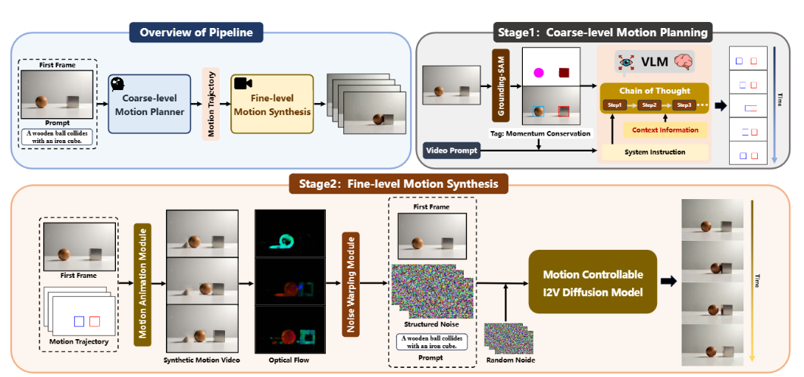
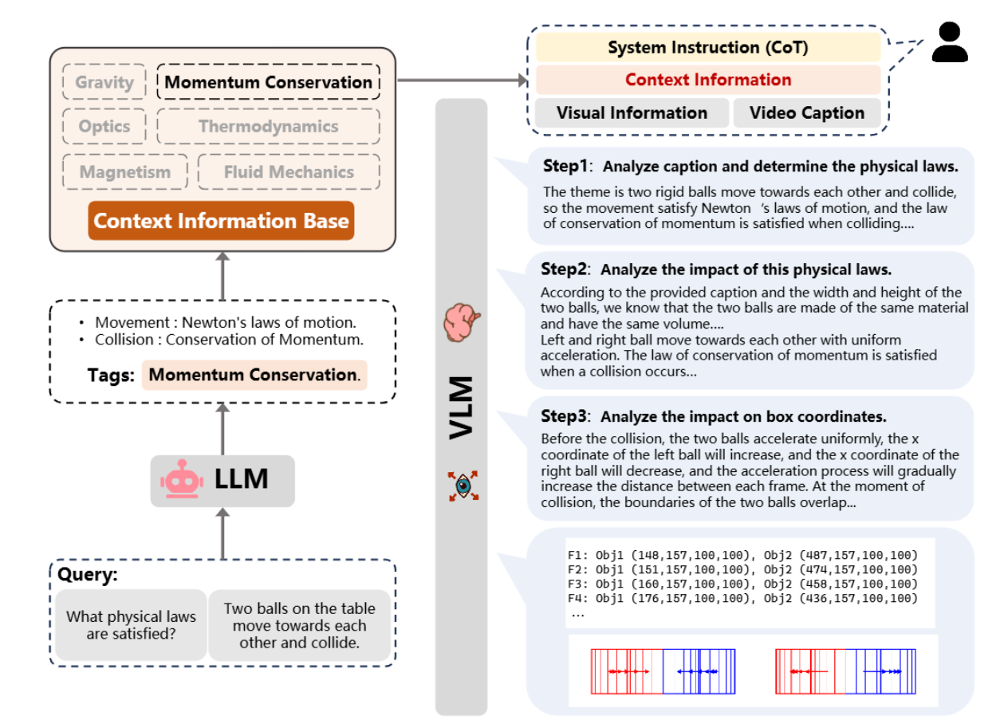

# VLIPP: Towards Physically Plausible Video Generation with Vision and Language Informed Physical Prior

## Introduction

>Consequently, a viable approach could be to model abstract physical laws as conditions for diffusion models. However, it is less practical to explicitly model the physics equation for every kind of motion. Instead, were sort to current large foundation models for their ability to “understand” basic physics[6] and reason about physical phenomena based on the knowledge they extract. For example, given two colliding balls, the Large Language Model(LLM) can approximately predict the paths of the balls after collision. Inspired by this observation, we propose a novel video generation framework that employs a Vision Language Model (VLM) to predict the path/change during a physics event, described by a given image and a text prompt.

因此，⼀个可⾏的⽅法可能是将抽象的物理定律建模为扩散模型的条件。然⽽，为每种运动显式地建模物理⽅程并不实⽤。相反，我们借助当前的⼤型基础模型，利⽤它们“理解”基本物理[6]以及基于提取的知识推理物理现象的能⼒。例如，对于两个相撞的球，⼤型语⾔模型（LLM）可以近似预测碰撞后球的运动路径。受此观察的启发，我们提出了⼀种新型视频⽣成框架，该框架采⽤视觉语⾔模型（VLM）来预测由给定图像和⽂本提⽰描述的物理事件中的路径/变化。

### VLIPP

> In the first stage, the VLM serves as a coarse-level motion planner,while a VDM serves as a fine-level motion synthesizer. The idea of stage one is to utilize the chain-of-thought and the physics-aware reasoning of VLM planning to ensure that coarse-level motion trajectories approximately follow real-world physics dynamics.

第⼀阶段的思想是利⽤ VLM 规划的思维链和物理感知推理，确保粗级运动轨迹⼤致遵循现实世界的物理动⼒学。第⼀阶段的思想是利⽤ VLM 规划的思维链和物理感知推理，确保粗级运动轨迹⼤致遵循现实世界的物理动⼒学。

> In stage two, we can generate fine-level motion using an image-to-video diffusion model conditioned by the approximated path/change planned by VLM from stage one. Note that the approximated path/changes are not in the level to tell the speed or acceleration of the motion. We choose an existing image-to-video model [7]to accept our coarse-level path/change, by injecting noise to the motion path during both the training and inference phases

在第⼆阶段，我们使⽤由 VLM 在第⼀阶段规划的近似路径/变化条件下的图像到视频扩散模型来⽣成细级运动。请注意，近似路径/变化并未说明运动的速度或加速度。我们选择⼀个现有的图像到视频模型[7]来接受我们的粗级路径/变化，通过在训练和推理阶段向运动路径注⼊噪声。

> Notably, during the VLM planning stage, generating entire physically plausible motion trajectories is not re-quired. Instead, we leverage the generative priors of VDM to produce fine-level physically plausible videos based on coarse-level motion trajectories provided by the VLM. So that the detail-level motion such as speed, acceleration, and vibration are left to the VDM to synthesize.

值得注意的是，在 VLM 规划阶段，并不需要⽣成整个符合物理的运动轨迹。 相反，我们利⽤ VDM 的⽣成先验，基于 VLM 提供的粗级运动轨迹⽣成精细级物理上合理的视频。因此，速度、加速度和振动等细节级运动由 VDM 合成

## Related Work

### Physically Plausible Visual Content Generation

> Figure 2. The illustration of our physically plausible image-to-video generation pipeline. Our pipeline consists of two stages. In the first stage, the VLM generates a coarse-grained, physically plausible motion trajectory based on the provided input conditions. In the second stage, We simulate a synthetic video using the predicted trajectory to provide the motion condition. We then extract the optical flow from this video and convert it into structured noise. These conditions are fed into a motion controllable image-to-video diffusion model, and ultimately generates a physically plausible video.

图 2. 我们物理上合理的图像到视频⽣成流程的⽰意图。我们的流程包含两个阶段。在第⼀阶段，视觉语⾔模型根据提供的输⼊条件⽣成粗粒度的物理上合理的运动轨迹。在第⼆阶段，我们使⽤预测的轨迹模拟合成视频以提供运动条件。然后我们从该视频中提取光流并将其转换为结构化噪声。这些条件被输⼊到运动可控的图像到视频扩散模型中，最终⽣成物理上合理的视频。

### Motion Controllable Video Generation

**现有研究提供的运动控制类型**

1. Bounding box control

   > Bounding box control provides object motion guidance by generating a sequence of bounding boxes that track the object’s position over time.

​	边界框控制通过⽣成⼀系列跟踪物体随时间位置变化的边界框来提供物体运动指导。

2. Point-trajectory control
   > Point-trajectory control offers motion cues through point-based trajectories, enabling drag-style manipulation. 

	点轨迹控制通过基于点的轨迹提供运动提⽰，实现拖拽式操作

3. Camera motion control

   > Camera motion control guides video generation using explicit3D camera parameters, ensuring consistency and realistic viewpoint changes

​	相机运动控制使⽤显式的 3D 相机参数来指导视频⽣成，确保视⻆变化的⼀致性和真实性

**缺点**

> However, these approaches priori-tize motion control but often overlook physical plausibility.

然⽽，这些⽅法优先考虑运动控制，但往往忽略了物理合理性。

### Generation based on VLMs Planning

**现有利⽤ LLMs 指导图像或视频的例子**

> VideoDirectorGPT [26] lever-ages LLMs for fine-grained scene-by-scene planning, explicitly controlling spatial layout to generate temporally consistent long videos

VideoDirectorGPT [26] 利⽤ LLMs 进⾏细粒度的逐场景规划，明确控制空间布局以⽣成时间上连贯的⻓视频。

> Pandora [55] utilizes LLMs for real-time control through free-text action commands, achieving domain generality, video consistency, and controllability.

Pandora[55] 利⽤ LLMs 通过⾃由⽂本动作指令实现实时控制实现领域泛化、视频⼀致性和可控性。

**缺点**

> However, these efforts have yet to address interactions with real-world physical phenomena, such as collision, fall, and melting.
>
> Moreover, the absence of visual information can cause severe hallucination issues in language models for spatial planning tasks, leading to problems like overlapping object boundaries, disproportionate scaling, and incorrect planning [20, 57].

然⽽，这些努⼒尚未解决与真实世界物理现象的交互，例如碰撞、跌倒和融化。此外，缺乏视觉信息会导致空间规划任务中的语⾔模型出现严重的幻觉问题，例如物体边界重叠、⽐例失调和规划错误[20, 57]。

## Method

>Given an image I and a text description d of possible events based on image I ,our framework should infer a physics-compliant guidance as the input condition and synthesize a video that adheres to both physical laws and real-world dynamics

给定⼀个图像 I 以及基于图像 I 的可能事件的⽂本描述 d，我们的框架应推断出符合物理的指导作为输⼊条件，并合成⼀个既符合物理定律⼜遵循真实世界动态的视频。

> Figure 3. The illustration of chain-of-thought reasoning in the VLM for generating a coarse-grained motion trajectory. First off, the VLM determines the corresponding physical laws and its context for the given scene. Then, the VLM performs step-by-step reasoning to predict the physically plausible motions of objects in image space, leveraging physical context and chain-of-thought prompting. Finally, the VLM predicts bounding boxes according to real-world physics.

图 3. VLM ⽣成粗粒度运动轨迹的推理链⽰意图。⾸先，VLM 确定给定场景对应的物理规律及其上下⽂。然后，VLM 进⾏逐步推理，利⽤物理上下⽂和推理链提⽰，预测图像空间中物体的物理上合理的运动。最后，VLM 根据现实世界物理预测边界框。

### VLM as a Coarse-Level Motion Planner

> **Scene Understanding.** We first initiate the process by identifying and locating objects within a scene. We employ GPT-4o [38] to recognize all objects that could be involved in physical phenomena as described in the text description
> d. These objects are subsequently detected and segmented using Grounded-SAM2 [41], yielding their bounding boxes. 

**场景理解:** 我们⾸先通过识别和定位场景中的物体来启动该过程。我们采⽤GPT-4o [38] 识别⽂本描述 d 中可能参与物理现象的所有对象。随后，使⽤ Grounded-SAM2 [41] 对这些对象进⾏检测和分割，并获取它们的边界框。

>**Physical-Aware Recognition.** We utilize the pretrained prior of the LLM to determine the physical laws applicable to the current scene. Following the configuration in the physical bench-mark [3, 31, 33], we currently classify common physical phenomena in videos into six categories: **gravity, momentum conservation, optics, thermodynamics, magnetism,and fluid mechanics**. Given a video description $d$, the LLM infers the physical law $l$ that governs the current scene. We provide the specific physical context information for VLM to enhance its understanding of physical laws [11].

**物理感知识别:** 我们利⽤LLM 的预训练先验来确定当前场景适⽤的物理定律。遵循物理基准[3, 31, 33]中的配置，我们⽬前将视频中常⻅的物理现象分为六类：**重⼒、动量守恒、光学、热⼒学、磁学和流体⼒学**。给定视频描述 $d$，LLM 推断出⽀配当前场景的物理定律 $l$。我们为 VLM 提供具体的物理上下⽂信息，以增强其对物理定律的理解[11]。

> **Chain of Thought Reasoning in VLM.** Given the physical law $l$, an image $I$ and a video description $d$ for the scene, we prompt the VLM to predict the future bounding box positions of objects within the image-space.

**VLM 中的思维链推理。**给定物理定律$ l$、图像 $I$ 以及场景的视频描述 $d$，我们提⽰ VLM 预测图像空间（二维）中物体未来的边界框位置。

> To help VLM better understand physical laws, we adapt a chain-of-thought [51] into its reasoning, to significantly enhance its reasoning capabilities. As shown in Figure 3, we formulate our analysis of physical phenomena in videos as step-by-step reasoning: beginning with broad conceptual ideas and progressing to a detailed and practical examination:
>
> 1. Given the physical law $l$ and context information, the VLM analysis video caption and detail the physical law.
> 2. The VLM analyzes the potential interactions and movement of each object within the scene;
> 3. The VLM predicts the detailed changes in position and shape of the bounding box corresponding to each object over time.

为了帮助 VLM 更好地理解物理定律，我们将其推理中引⼊了思维链[51]，显著增强了其推理能⼒。如图 3 所⽰，我们将视频中物理现象的分析表述为逐步推理：从宏观概念开始，逐步深⼊到详细和实⽤的检查：
1. 基于物理定律 l 和上下⽂信息，VLM 分析视频标题并详细说明物理定律。
2.  VLM 分析场景中每个对象的潜在交互和运动；
3. VLM 预测每个对象对应的边界框随时间变化的位置和形状的详细变化。

### VDM Serves as a Fine-Level Motion Synthesizer

## Empirical Analysis and Discussion

### Implementation Details

>We propose a two-stage physically plausible image-to-video generation framework. In the first stage, we utilize ChatGPT-4o as the coarse-level motion planner. In the second stage, we utilize an open-source I2V model, Go-with-the-Flow [7], as a fine-level motion synthesizer. Unless otherwise specified, in all experiments, we generate each video with a resolution of 720×480 and 49 frames.

我们提出了⼀种两阶段物理上合理的图像到视频⽣成框架。在第⼀阶段，我们使⽤ ChatGPT-4o 作为粗粒度运动规划器。在第⼆阶段，我们使⽤开源 I2V 模型 Go-with-the-Flow [7]作为细粒度运动合成器。除⾮另有说明，在所有实验中，我们以720 × 480 分辨率和 49 帧⽣成每个视频

### Benchmarks and Models

> **PhyGenBench**[31] categorizes physical properties into four domains: mechanics, optics, thermal, and material. It includes 27 physical phenomena, each governed by real world physical laws, reflected in 160 carefully designed text prompts. As PhyGenbench provides only text prompts,we adapt it to our image-to-video setting by generating a corresponding first frame for each prompt with FLUX[22].We adhere to the predefined benchmark evaluation proto-col, i.e., employing GPT-4o to assess the physical realism of the generated videos.

**PhyGenBench** [31] 将物理属性分为四个领域：⼒学、光学、热学和材料学。它包含 27 种物理现象，每种现象都受现实世界物理定律的⽀配，体现在 160 个精⼼设计的⽂本提⽰中。由于 PhyGenbench 仅提供⽂本提⽰，我们通过使⽤FLUX[22]为每个提⽰⽣成相应的第⼀帧图像，将其应⽤于我们的图像到视频设置。我们遵循预定义的基准评估协议，即使⽤ GPT-4o 来评估⽣成视频的物理真实性

> Physics-IQ[33] comprises 396 real-world videos spanning66 distinct physical scenarios. For each scenario, videos are recorded from three different perspectives and filmed twice under identical conditions to eliminate randomness. This benchmark evaluates real-world physical phenomena, including collisions, object continuity, occlusion, object permanence, and fluid dynamics. This benchmark assesses physical realism from semantic and temporal perspectives,using semantic metrics and visual metrics to compare generated videos against the real-world reference videos.

**Physics-IQ** [33] 包含 396 个真实世界视频，涵盖 66 种不同的物理场景。对于每个场景，从三个不同的视⻆进⾏录像，并在相同条件下拍摄两次以消除随机性。该基准评估真实世界的物理现象，包括碰撞、物体连续性、遮挡、物体持久性和流体动⼒学。该基准从语义和时间⻆度评估物理真实性，使⽤语义指标和视觉指标将⽣成的视频与真实世界参考视频进⾏⽐较。

### Quantitative Evaluation

### Qualitative Evaluation

### Ablation Study

### User Study

### Limitations

## 个人记录

本论文并没有在模型训练上提出新观点，而是在VDM现有能力基础上增加VLM引导，通过**物理感知思维链（CoT）提示**和**物理类别上下文注入**实现能力赋能

### 物理现象

论文结合**PhyGenBench**、**Physics-IQ**两个核心基准及实验样例，提及了多类物理现象，涵盖力学、光学、热学、流体动力学、磁学、材料学等领域，具体分类及现象及可提取的物理参数如下：

#### 力学

 **物理现象**

- 重力主导运动：物体自由下落（如木质球从高处下落）、弹性碰撞（如橡胶球撞击地面后反弹）、物体浮沉（铁块/木块/石头轻置于水面的重力-浮力平衡）
- 动量守恒相关：刚性物体相向碰撞（如桌面上两小球相向运动并碰撞、灰色网球撞击橙色/棕色网球）、碰撞后动量传递（等材质/等体积小球的碰撞轨迹变化）
- 固体力学其他现象：刚性物体微小形变（小球撞击桌面时的压缩形变）、物体运动连续性与遮挡交互

**物理参数**

- **下落高度参数**：木质球自由下落的初始高度为**1米**（补充材料中明确提及的实验场景参数）
- **物体边界框（Bounding Box）坐标/尺寸**
  - 木质球初始边界框：`[303.0, 82.2, 108, 108]`（`[x,y,宽,高]`，单位为像素，下同）；碰撞压缩时高度短暂降至`104`，后恢复`108`
  - 相向碰撞小球初始边界框：Obj1`(148, 157, 100, 100)`、Obj2`(487, 157, 100, 100)`；碰撞前Obj1 x坐标递增、Obj2 x坐标递减，碰撞时边界框重叠
- **运动帧数参数**：VLM粗规划阶段预测**12帧**物体边界框变化，后经线性插值扩展至**49帧**以适配VDM生成规格
- **视频分辨率**：力学类场景生成视频统一为**720×480像素**

#### 流体动力学

**物理现象**

- 流体倾倒与液面变化：向透明玻璃杯倒清水/威士忌/茶（伴随液面上升与波纹）、玻璃饮料机向下方杯子倾倒红色液体
- 流体分层与混合：油缓慢倒入水杯后的油水分层
- 流体-容器交互：液体倾倒时容器内液体底部边界固定、顶部边界随液面抬升移动

**物理参数**

- **流体边界框坐标/尺寸**
  - 茶水初始边界框：`[241.8, 335.3, 165, 88]`；随液面上升，Frame13时边界框变为`[231.7, 268.0, 179, 156]`（宽度从165扩展至179，高度从88增至156）
- **流体运动帧数**：与力学场景一致，最终生成**49帧**流体动态视频
- **容器形态参数**：实验场景中容器为标准圆柱形玻璃杯（补充材料明确的几何形态）

#### 热力学

**物理现象**

- 温度驱动相变：蜡烛随温度显著升高而融化、黄油遇热软化
- 热化学反应：浓硫酸倾倒在棉花上的放热反应（timelapse场景下的物质形态剧变）

**物理参数**

- **观测维度参数**：热学现象采用**timelapse（延时摄影）**模式记录（无具体温度数值，但明确“温度显著升高”的环境条件）
- **物体边界框变化**：蜡烛/黄油相变过程中，其边界框高度随融化/软化逐渐扩展（无固定数值，但呈现持续形变趋势）
- **视频帧数**：热学场景生成视频为**49帧**，与其他物理场景规格统一

#### 光学

**物理现象**

- 光的反射：物体表面的光反射效应（补充材料中光反射场景的视频生成样例）
- 光的折射：透明玻璃/液体介质中的光折射（如玻璃杯装液体的光学效果）

**物理参数**

- 光学场景视频分辨率为**720×480像素**、帧数**49帧**（无具体光学参数如折射率，仅明确场景的光学效应类型）

#### 磁学

**物理现象**

- 磁体的吸引/排斥作用（Physics-IQ基准中磁学领域的分类场景，论文未给出具体实验样例）

**物理参数**

- 仅明确磁学场景的视频分类数量：Physics-IQ中磁学类视频共**6个**，无具体磁通量、磁场强度等参数

#### 材料学

**物理现象**

- 不同材质交互：木质球与铁立方的碰撞（材质对运动轨迹的影响）
- 材料浮沉特性：铁块下沉、木块/石头的浮力平衡（不同密度材料与水的交互）
- 材料分层特性：油与水的密度分层（油浮于水面的材料特性表现）

**物理参数**

- **材质关联的边界框参数**：铁块/木块轻置于水面时，初始边界框尺寸与力学场景一致（如木块初始框规格与小球类同）
- **材料场景视频规格**：分辨率**720×480像素**、帧数**49帧**，部分场景（如油水混合）采用FLUX生成初始帧以保证输入一致性

各现象对应的基准/样例来源

1. **PhyGenBench**：涵盖上述力学（40个prompt）、光学（50个prompt）、热学（40个prompt）、材料学（20个prompt）的27类核心现象，含165类物体、42种动作的交互；
2. **Physics-IQ**：包含固体力学（114个视频）、流体动力学（45个视频）、光学（24个视频）、磁学（6个视频）、热力学（9个视频）的66类真实物理场景；
3. **实验/补充材料样例**：如油水混合、浓硫酸与棉花反应、蜡烛/黄油融化、小球自由下落反弹、网球碰撞等具象化现象。